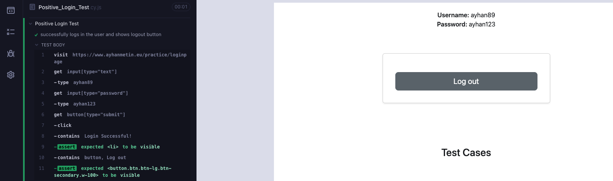

# Cypress Test Cases for Login Page

This document outlines the Cypress test cases developed for the login functionality, ensuring both positive and negative scenarios are covered for robust validation.

[Go to tests](https://github.com/ayhanmetin/Login-Page-Cypress-Test-Automation/tree/main/cypress/cypress_LoginPage_ScreenShot)

## Test Case 1: Positive LogIn Test

Verifies successful login with correct username and password.



[Go to code](https://github.com/ayhanmetin/Login-Page-Cypress-Test-Automation/blob/main/cypress/e2e/Test_Login_Page/Positive_Login_Test.cy.js)

## Test Case 2: Negative Username Test

Checks the behavior when an incorrect username is entered.


[Go to code](https://github.com/ayhanmetin/Login-Page-Cypress-Test-Automation/blob/main/cypress/e2e/Test_Login_Page/Negative_Username_%20Test.cy.js)

## Test Case 3: Negative Password Test

Validates the response to entering an incorrect password.


[Go to code](https://github.com/ayhanmetin/Login-Page-Cypress-Test-Automation/blob/main/cypress/e2e/Test_Login_Page/Negative_Password_Test.cy.js)

## Test Case 4: Username Field Validation

Ensures the application prompts when the username field is left empty.


[Go to code](https://github.com/ayhanmetin/Login-Page-Cypress-Test-Automation/blob/main/cypress/e2e/Test_Login_Page/Username_Field_Validation_Test.cy.js) 

## Test Case 5: Password Field Validation

Confirms that leaving the password field empty triggers an error message.


[Go to code](https://github.com/ayhanmetin/Login-Page-Cypress-Test-Automation/blob/main/cypress/e2e/Test_Login_Page/Password_Field_Validation_Test.cy.js)

## Test Case 6: Password Strength Test

Tests the application's password strength validation by entering a weak password.


[Go to code](https://github.com/ayhanmetin/Login-Page-Cypress-Test-Automation/blob/main/cypress/e2e/Test_Login_Page/Password_Strength_Test.cy.js)

---------------------------------------------------------


## Setup and Running Tests Locally

To run these Cypress tests on your computer, follow the steps below for setup and execution.

### 1. Clone the Repository

First, clone the repository to your local machine:

```bash
git clone https://github.com/ayhanmetin/Login-Page-Cypress-Test-Automation.git
cd Login-Page-Cypress-Test-Automation
```

### 2. Inside the project directory, install the necessary dependencies:

```bash
npm install
```

### 3. To open the Cypress Test Runner for an interactive testing experience, use:

```bash
npx cypress open
```

